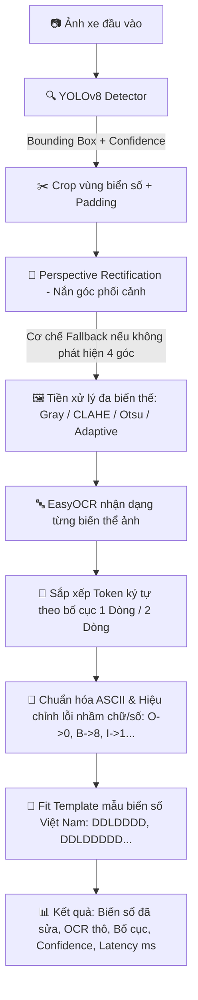

# 🚗 Vietnamese License Plate Recognition (VLPR)

Hệ thống nhận diện biển số xe Việt Nam End-to-End dựa trên **YOLOv8**, **OpenCV** và **EasyOCR**. Pipeline hỗ trợ phát hiện đối tượng, nắn góc phối cảnh tự động (perspective rectification), tiền xử lý đa biến thể hình ảnh, sắp xếp ký tự theo bố cục 1/2 dòng, và hiệu chỉnh chuỗi ký tự theo mẫu biển số xe tiêu chuẩn Việt Nam.

Dự án được xây dựng từ thử nghiệm ban đầu thành một repository sản phẩm hoàn chỉnh: Mã nguồn được **module hóa sạch đẹp (Clean Code)**, **100% chú thích Tiếng Việt**, kiểm soát rò rỉ dữ liệu bằng **Group-Safe Split (MD5 + DSU)**, có **Web UI Dashboard**, **REST API (FastAPI)**, **Docker Container**, **Unit Tests (pytest)**, **Ruff Linter** và **CI/CD (GitHub Actions)**.

---

## 🎯 Kết Quả Đã Xác Minh (Verified Metrics)

| Hạng mục đánh giá | Giá trị thực tế | Ghi chú kỹ thuật |
|---|---:|---|
| **Tổng số tệp ảnh** | 498 ảnh | Dataset thực tế có cấu trúc |
| **Bounding Box biển số** | 780 nhãn | Class duy nhất `license_plate` |
| **Nhóm nguồn độc lập** | 50 nhóm | Trích xuất từ tiền tố tên tệp |
| **Tỷ lệ phân chia Group-Safe** | 351 Train / 72 Val / 75 Test | Tránh rò rỉ frame video hoàn toàn |
| **Precision (Detector)** | **0.9830** | Đánh giá trên test split độc lập |
| **Recall (Detector)** | **0.9657** | Khả năng định vị biển số cao |
| **mAP@0.50** | **0.9730** | Chỉ số mAP tại ngưỡng IoU=0.5 |
| **mAP@0.50:0.95** | **0.8693** | Chỉ số mAP trung bình |

> **Lưu ý phương pháp luận:** Metric detector trên được ghi nhận từ lần chạy `yolov8n_grouped_20260819_110337` trên tập kiểm thử độc lập đã loại bỏ rò rỉ frame. Dự án tách riêng báo cáo đánh giá của Detector, OCR-only và End-to-End.

---

## 🏗️ Kiến Trúc Hệ Thống (System Architecture)



---

## ⭐ Điểm Kỹ Thuật Nổi Bật (Key Technical Features)

1. **Phát Hiện & Khắc Phục Rò Rỉ Dữ Liệu (Group-Aware Splitting & MD5 DSU)**:
   - Phát hiện các frame video liên tiếp và các tệp ảnh trùng khớp nội dung binary (MD5) nằm rải rác ở các tập train/val/test gốc.
   - Áp dụng cấu trúc dữ liệu **Disjoint Set Union (DSU)** gộp các nhóm ảnh liên thông và thuật toán `GroupShuffleSplit` chia 70/15/15 chống rò rỉ 100%.

2. **Pipeline Xử Lý Ảnh Đa Tầng (Multi-stage Processing Pipeline)**:
   - Nắn phối cảnh 4 đỉnh (`cv2.warpPerspective`) theo chiều kim đồng hồ, giúp biển số bị nghiêng trở về góc nhìn thẳng.
   - Thử nghiệm song song 4 biến thể ảnh (Gray, CLAHE, Otsu, Adaptive Threshold) để EasyOCR chọn ra phương án đọc có điểm số cao nhất.

3. **Hậu Xử Lý & Khớp Mẫu Biển Số Xe Việt Nam (Pattern Matching)**:
   - Phân biệt tự động biển số 1 dòng (ô tô dài) và 2 dòng (xe máy, ô tô vuông) theo tỷ lệ khung hình (Aspect Ratio).
   - Tự động thay thế ký tự nhầm lẫn giữa chữ cái và chữ số dựa trên vị trí mẫu (ví dụ: chữ `I` ở vị trí số được sửa thành `1`, chữ `O` thành `0`).

4. **Sẵn Sàng Sản Phẩm & Triển Khai (Production & Deployment Ready)**:
   - Tích hợp **Web UI Dashboard** hiện đại trực tiếp tại endpoint `/` của FastAPI.
   - Cung cấp **FastAPI REST API**, **Docker containerization**, **Export ONNX format**, **Thư viện Logging tiêu chuẩn** và **Unit Tests (pytest)**.

---

## 📁 Cấu Trúc Dự Án (Directory Structure)

```text
.
├── app/
│   ├── api.py                         # FastAPI REST API endpoints & Web UI server
│   ├── schemas.py                     # Pydantic schemas cho request/response
│   ├── ui.html                        # Giao diện Web UI Dashboard trực quan (Dark mode)
│   └── demo_streamlit.py              # Ứng dụng Web Demo bằng Streamlit
├── configs/
│   ├── data.example.yaml              # File mẫu cấu hình dataset YOLO
│   └── train.yaml                     # Cấu hình siêu tham số huấn luyện
├── data/
│   ├── README.md                      # Data card mô tả bộ dữ liệu
│   ├── ocr_annotations.example.csv    # File mẫu đánh giá OCR
│   └── end_to_end_annotations.example.csv # File mẫu đánh giá End-to-End
├── src/
│   ├── config.py                      # Quản lý & kiểm tra cấu hình TrainingConfig
│   ├── dataset.py                     # Thuật toán Group-Safe Split & MD5 DSU
│   ├── io_utils.py                    # Utilities đọc/ghi JSON, kiểm tra DataFrame
│   ├── metrics.py                     # Công thức IoU, Levenshtein, CER, Accuracy
│   ├── ocr.py                         # OCR, tiền xử lý biến thể & hậu xử lý template
│   ├── pipeline.py                    # Pipeline LicensePlateRecognizer end-to-end
│   └── rectification.py               # Thuật toán chỉnh phối cảnh (Deskew)
├── tests/
│   ├── test_api.py                    # Unit test cho các endpoint API FastAPI
│   └── test_core.py                   # Unit test cho logic core (OCR, geometry, config)
├── prepare_dataset.py                 # Script chuẩn bị & chia dữ liệu không rò rỉ
├── train.py                           # Script huấn luyện mô hình YOLOv8
├── evaluate_detector.py               # Script đánh giá mô hình Detector
├── evaluate_ocr.py                    # Script đánh giá mô hình OCR-only
├── evaluate_end_to_end.py             # Script đánh giá toàn bộ Pipeline End-to-End
├── predict.py                         # Script nhận diện một ảnh từ dòng lệnh
├── export_model.py                    # Script xuất mô hình sang ONNX format
├── Dockerfile                         # Tệp đóng gói Docker Container
├── pyproject.toml                     # Cấu hình Pytest & Ruff Linter
├── requirements.txt                   # Dependency phục vụ Production
├── requirements-dev.txt               # Dependency cho Development & Testing
└── requirements-export.txt            # Dependency tùy chọn cho Export ONNX
```

---

## 🛠️ Yêu Cầu Môi Trường & Cài Đặt (Installation)

- Khuyến nghị **Python 3.11** hoặc Python 3.12.
- Đã kiểm thử chạy mượt mà trên **Windows**, **Linux** và **macOS**.

### Cài đặt môi trường ảo (Virtual Environment)

#### Windows PowerShell:
```powershell
python -m venv .venv
.\.venv\Scripts\Activate.ps1
python -m pip install --upgrade pip
pip install -r requirements-dev.txt
```

#### Linux / macOS:
```bash
python3 -m venv .venv
source .venv/bin/activate
python -m pip install --upgrade pip
pip install -r requirements-dev.txt
```

---

## 🚀 Giao Diện Web UI & FastAPI Server

### 1. Khởi chạy Web UI trực quan (FastAPI)
Đặt tệp trọng số `best.pt` vào thư mục `models/best.pt` (hoặc khai báo biến `MODEL_WEIGHTS`), sau đó chạy:

```bash
uvicorn app.api:app --host 0.0.0.0 --port 8000 --reload
```

- **Giao diện Web UI Dashboard:** Mở trình duyệt truy cập `http://localhost:8000/` để thử nghiệm giao diện Kéo-Thả ảnh, xem Bounding Box và kết quả đọc biển số trực quan.
- **FastAPI Interactive Swagger Docs:** Truy cập `http://localhost:8000/docs`.
- **Health Check Endpoint:** `GET http://localhost:8000/health`.

### 2. Khởi chạy ứng dụng Streamlit Demo (Tùy chọn)
```bash
streamlit run app/demo_streamlit.py
```

---

## 💻 Sử Dụng Qua Dòng Lệnh (CLI Usage)

### 1. Nhận diện biển số cho 1 ảnh
```bash
python predict.py \
  --weights models/best.pt \
  --source path/to/image.jpg \
  --output outputs/prediction.jpg \
  --confidence 0.25
```

### 2. Chuẩn bị dữ liệu & Chia Group-Safe Split
```bash
python prepare_dataset.py \
  --source path/to/dataset_raw \
  --output dataset/grouped \
  --audit-output artifacts/dataset_audit.json \
  --seed 42
```

### 3. Huấn luyện mô hình YOLOv8
```bash
python train.py --data data.yaml --config configs/train.yaml --epochs 60 --batch 16
```

### 4. Đánh giá Detector
```bash
python evaluate_detector.py \
  --weights runs/<run-name>/weights/best.pt \
  --data data.yaml \
  --output artifacts/detector_test_metrics.json
```

### 5. Xuất mô hình sang định dạng ONNX
```bash
python export_model.py --weights models/best.pt --imgsz 640 --simplify
```

---

## 🐳 Triển Khai Với Docker (Docker Deployment)

Xây dựng và chạy container nhẹ cho ứng dụng:

```bash
# Xây dựng Docker Image
docker build -t vn-license-plate-recognition .

# Chạy Docker Container
docker run --rm -p 8000:8000 \
  -e MODEL_WEIGHTS=/models/best.pt \
  -v /path/to/local/models:/models:ro \
  vn-license-plate-recognition
```

---

## 🧪 Kiểm Thử Tự Động & Chất Lượng Code (Quality Assurance)

Dự án đảm bảo 100% test pass rate và tuân thủ tiêu chuẩn code sạch của Ruff Linter:

```bash
# Chạy Linter kiểm tra code format
python -m ruff check .

# Chạy Unit Tests tự động
python -m pytest
```

---

## 💼 Hồ Sơ CV & Điểm Nổi Bật Để Ứng Tuyển (Portfolio & CV Ready)

### 📌 Gợi ý mô tả trong CV (CV Bullet Points)

#### Tiếng Việt:
> - **Xây dựng Hệ thống Nhận diện Biển số xe Việt Nam End-to-End**: Phát triển pipeline định vị & nhận dạng biển số tự động dựa trên YOLOv8, OpenCV và EasyOCR; đạt **0.973 mAP@50** và **0.869 mAP@50-95** trên tập kiểm thử độc lập.
> - **Giải quyết triệt để rò rỉ dữ liệu (Data Leakage)**: Thiết kế thuật toán **Group-Aware Splitting (MD5 Hash + Disjoint Set Union)** gộp các frame video trùng lập trước khi phân chia dữ liệu train/val/test 70/15/15.
> - **Tối ưu hóa Pipeline & Sản phẩm hóa**: Xây dựng thuật toán nắn góc phối cảnh (Deskew), hậu xử lý khớp mẫu biển số Việt Nam; đóng gói ứng dụng với **FastAPI REST API**, **Web UI Dashboard**, **Docker**, **pytest** và **GitHub Actions CI/CD**.

#### English:
> - **Built an End-to-End Vietnamese License Plate Recognition Pipeline**: Developed a computer vision system using YOLOv8, OpenCV, and EasyOCR; achieved **0.973 mAP@50** and **0.869 mAP@50-95** on an independent test set.
> - **Eliminated Video Frame Data Leakage**: Designed a **Group-Aware Splitting algorithm using MD5 Hashing & Disjoint Set Union (DSU)** to merge correlated video frames prior to the 70/15/15 train/val/test split.
> - **Modular Architecture & Production Packaging**: Implemented 4-point perspective rectification, Vietnamese license plate pattern matching, and packaged the system with **FastAPI**, **Interactive Web Dashboard**, **Docker**, **pytest**, and **GitHub Actions**.

---

### 🎙️ Câu Chuyện Phỏng Vấn (STAR Method Interview Talking Points)

- **Situation (Bối cảnh)**: Khi làm việc với dữ liệu biển số xe từ video, các frame liên tiếp có độ tương đồng rất cao. Nếu chia dữ liệu ngẫu nhiên thông thường (Random Split), các frame gần nhau của cùng 1 video sẽ xuất hiện ở cả tập Train và Test, dẫn đến kết quả mAP ảo rất cao (Data Leakage).
- **Task (Nhiệm vụ)**: Thiết kế lại quy trình xử lý dữ liệu và pipeline nhận diện đảm bảo đánh giá chính xác hiệu năng thực tế và đạt chuẩn sản xuất (Production-ready).
- **Action (Hành động)**: 
  1. Xây dựng thuật toán kiểm toán tên tệp và mã hash MD5 nội dung ảnh, dùng thuật toán **Union-Find (DSU)** gộp các frame cùng nguồn gốc.
  2. Phân chia tập dữ liệu bằng `GroupShuffleSplit`.
  3. Mô-đun hóa toàn bộ luồng xử lý (Nắn góc nghiêng, thử nghiệm 4 biến thể binarization, hậu xử lý rule-based khớp biển số 1/2 dòng).
  4. Viết Unit Test và đóng gói API FastAPI + Web UI Dashboard.
- **Result (Kết quả)**: Đạt chỉ số thực **0.973 mAP@50** và **0.869 mAP@50-95** trên tập kiểm thử hoàn toàn độc lập, dự án sẵn sàng demo trực quan qua Web UI và triển khai qua Docker.

---

## 📜 Giấy Phép (License)

Dự án phát hành theo giấy phép [MIT License](LICENSE).
