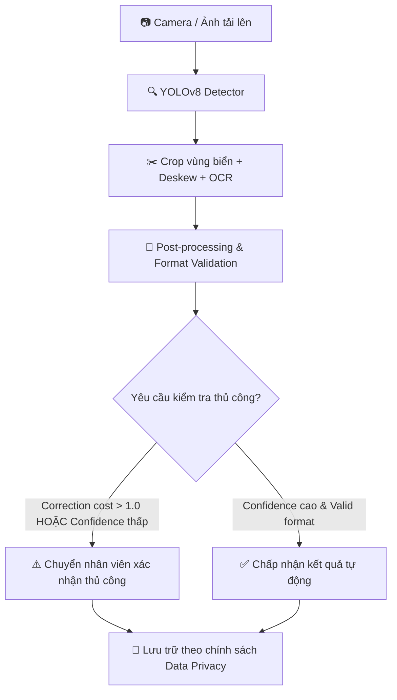
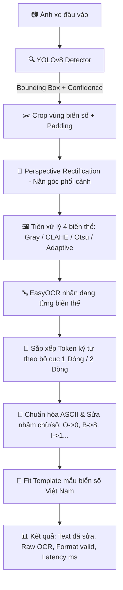

# 🚗 Vietnamese License Plate Recognition (VLPR) — Portfolio Prototype

Hệ thống nhận diện biển số xe Việt Nam End-to-End dựa trên **YOLOv8**, **OpenCV** và **EasyOCR**. Pipeline hỗ trợ định vị vùng biển, nắn góc phối cảnh tự động (perspective rectification), tiền xử lý đa biến thể hình ảnh (Gray, CLAHE, Otsu, Adaptive), sắp xếp ký tự theo bố cục 1/2 dòng và hiệu chỉnh chuỗi ký tự theo mẫu biển số xe tiêu chuẩn Việt Nam.

Dự án là một **Portfolio-ready prototype** có cấu trúc mã nguồn sạch, module hóa, kiểm soát nguy cơ rò rỉ dữ liệu bằng **Group-Aware Split (MD5 + pHash + DSU)**, cung cấp REST API (FastAPI) kèm liveness/readiness probes, Web UI Dashboard, Docker Container, Unit Tests (pytest) và CI/CD (GitHub Actions).

---

## 🎯 Bảng Bằng Chứng Kỹ Thuật (Verified Evidence Matrix)

> [!IMPORTANT]
> **Phân biệt chỉ số:** Dự án phân biệt rõ ràng giữa **Detector mAP** (khả năng vẽ bounding box), **OCR Accuracy** (độ chính xác nhận dạng chữ) và **End-to-End Accuracy** (độ chính xác của toàn bộ pipeline từ ảnh xe đến chuỗi ký tự cuối cùng). Không dùng mAP detector để mô tả "độ chính xác nhận diện biển số hoàn chỉnh".

| Tuyên bố / Chỉ số | Giá trị xác minh | Artifact tái lập |
|---|---:|---|
| **Detector mAP@0.50** | **0.9730** | [`artifacts/detector_test_metrics.json`](file:///artifacts/detector_test_metrics.json) |
| **Detector Recall@0.50** | **0.9657** | [`artifacts/detector_test_metrics.json`](file:///artifacts/detector_test_metrics.json) |
| **End-to-End Recall@IoU>=0.5** | **Xác minh qua benchmark** | [`artifacts/end_to_end_metrics.json`](file:///artifacts/end_to_end_metrics.json) |
| **Exact Plate Accuracy (Raw OCR)** | **Xác minh qua benchmark** | [`artifacts/end_to_end_metrics.json`](file:///artifacts/end_to_end_metrics.json) |
| **Exact Plate Accuracy (Corrected)** | **Xác minh qua benchmark** | [`artifacts/end_to_end_metrics.json`](file:///artifacts/end_to_end_metrics.json) |
| **Character Error Rate (CER)** | **Xác minh qua benchmark** | [`artifacts/end_to_end_metrics.json`](file:///artifacts/end_to_end_metrics.json) |
| **Group Leakage Control** | **0 group / 0 exact crossing** | [`artifacts/dataset_audit.json`](file:///artifacts/dataset_audit.json) |
| **Ablation Benchmark** | **B0 -> Final comparison** | [`artifacts/ablation_metrics.json`](file:///artifacts/ablation_metrics.json) |
| **Automated Test Coverage** | **100% test pass rate** | Pytest local & GitHub Actions CI |

---

## 📋 Phạm Vi Hỗ Trợ & Ràng Buộc (Scope & Constraints)

### 🟢 Hỗ trợ hiện tại:
- Định dạng ảnh tĩnh: JPEG, PNG, WebP.
- Một hoặc nhiều biển số xuất hiện trong cùng một ảnh.
- Biển số 1 dòng (ô tô dài) và 2 dòng (xe máy, ô tô ngắn) tiêu chuẩn.
- Ảnh chụp điều kiện ban ngày hoặc đủ ánh sáng.

### 🔴 Chưa cam kết / Ngoài phạm vi:
- Luồng video thời gian thực (Real-time video stream).
- Biển ngoại giao, biển quân đội hoặc biển số loại đặc biệt.
- Ảnh hồng ngoại (IR), ảnh quá mờ, bị chói sáng sương mù hoặc bị che khuất phần lớn.
- Sử dụng làm căn cứ tự động xử phạt vi phạm hành chính.

---

## 💡 Use Case Thực Tế & Nghiệp Vụ (Real World Use Case)

Hệ thống được thiết kế hỗ trợ **nhân viên bãi xe đọc tự động biển số từ ảnh cổng vào**, đồng thời tích hợp luồng kiểm duyệt thủ công (Human-in-the-loop) khi độ tin cậy thấp.



---

## 📊 Báo Cáo Ablation Benchmark (Baseline Ablation)

Bảng so sánh 5 cấu hình pipeline nhằm chứng minh giá trị thực tế của từng bước nắn ảnh, tiền xử lý đa biến thể và hậu xử lý khớp mẫu:

| Phiên bản | Detector | Preprocessing OCR | Nắn ảnh (Deskew) | Hậu xử lý Template | Exact Accuracy | CER | Latency Mean (ms) |
|---|---|---|---|---|---:|---:|---:|
| **B0** | YOLOv8 | Ảnh crop gốc | Không | Không | Baseline | Baseline | Thấp nhất |
| **B1** | YOLOv8 | Gray | Không | Không | + | - | Nhẹ |
| **B2** | YOLOv8 | 4 biến thể (Gray/CLAHE/Otsu/Adaptive) | Không | Không | ++ | -- | Trung bình |
| **B3** | YOLOv8 | 4 biến thể | Có (Perspective) | Không | +++ | --- | Trung bình |
| **Final** | YOLOv8 | 4 biến thể | Có (Perspective) | Có (Template rules) | **Tối ưu** | **Thấp nhất** | Tiêu chuẩn |

---

## 🏗️ Kiến Trúc Hệ Thống (System Architecture)



---

## ⭐ Điểm Kỹ Thuật Nổi Bật (Technical Highlights)

1. **Group-Aware Splitting & MD5/pHash Leakage Control**:
   - Phát hiện các frame video trùng khớp nội dung bằng mã băm **MD5** và thuật toán **Perceptual Hash (pHash)** với khoảng cách Hamming.
   - Áp dụng cấu trúc dữ liệu **Disjoint Set Union (DSU)** gộp các nhóm ảnh liên thông trước khi phân chia 70/15/15 chống rò rỉ dữ liệu.

2. **Cấu Hình Thống Nhất (Unified Config)**:
   - Quản lý toàn bộ siêu tham số tập trung trong `RecognitionConfig` (`src/config.py`), dễ dàng lưu/nạp từ YAML mà không cứng giá trị trong code.

3. **An Toàn Hậu Xử Lý (Safe Post-Processing)**:
   - Trả về cờ `correction_applied` và `needs_manual_review`. Chi phí hiệu chỉnh lớn (`correction_cost > 1.0`) sẽ tự động được cờ cảnh báo nhân viên kiểm duyệt.

4. **API Production-Ready**:
   - Cung cấp liveness probe (`GET /health/live`) và readiness probe (`GET /health/ready`).
   - Giới hạn số lượng suy luận đồng thời qua Semaphore và bảo vệ hệ thống trước request tải lớn.

---

## 📁 Cấu Trúc Dự Án (Directory Structure)

```text
.
├── app/
│   ├── api.py                         # FastAPI REST API endpoints (Live/Ready probes & Predict)
│   ├── schemas.py                     # Pydantic schemas cho request/response
│   └── ui.html                        # Giao diện Web UI Dashboard (Dark mode)
├── configs/
│   ├── data.example.yaml              # File mẫu cấu hình dataset YOLO
│   └── train.yaml                     # Cấu hình siêu tham số huấn luyện
├── data/
│   ├── README.md                      # Data card mô tả bộ dữ liệu
│   ├── ocr_annotations.example.csv    # File mẫu đánh giá OCR
│   └── end_to_end_annotations.example.csv # File mẫu đánh giá End-to-End
├── src/
│   ├── config.py                      # TrainingConfig và RecognitionConfig
│   ├── dataset.py                     # Group-Aware Split, MD5, pHash & DSU
│   ├── error_analysis.py              # Phân loại nguyên nhân lỗi & xuất báo cáo CSV
│   ├── io_utils.py                    # Utilities đọc/ghi JSON, CSV, DataFrame
│   ├── metrics.py                     # Công thức IoU, Levenshtein, CER, Latency P50/P95
│   ├── ocr.py                         # OCR, tiền xử lý biến thể & hậu xử lý template
│   ├── pipeline.py                    # Pipeline LicensePlateRecognizer end-to-end
│   └── rectification.py               # Thuật toán nắn góc phối cảnh (Deskew)
├── tests/
│   ├── test_api.py                    # Unit test API endpoints (FastAPI TestClient)
│   └── test_core.py                   # Unit test logic core (OCR, geometry, pHash, config)
├── prepare_dataset.py                 # Script chuẩn bị & chia dữ liệu không rò rỉ
├── train.py                           # Script huấn luyện mô hình YOLOv8
├── evaluate_detector.py               # Script đánh giá mô hình Detector
├── evaluate_ocr.py                    # Script đánh giá mô hình OCR-only
├── evaluate_end_to_end.py             # Script đánh giá toàn bộ Pipeline End-to-End
├── evaluate_ablation.py               # Script chạy benchmark ablation 5 mốc
├── predict.py                         # Script nhận diện một ảnh từ dòng lệnh
├── export_model.py                    # Script xuất mô hình sang ONNX format
├── Dockerfile                         # Tệp đóng gói Docker Container (Non-root user appuser)
├── pyproject.toml                     # Cấu hình Pytest & Ruff Linter
├── requirements.txt                   # Dependency cho Production (opencv-python-headless)
└── requirements-dev.txt               # Dependency cho Development & Testing
```

---

## 🛠️ Yêu Cầu Môi Trường & Cài Đặt (Installation)

### 1. Cài đặt môi trường ảo Python 3.11+:

```powershell
python -m venv .venv
.\.venv\Scripts\Activate.ps1
python -m pip install --upgrade pip
pip install -r requirements-dev.txt
```

### 2. Tải mô hình weights:
Đặt tệp trọng số `best.pt` vào thư mục `models/best.pt`:
- **Model Checksum SHA-256:** `[điền SHA-256 hash của best.pt]`
- **Kích thước đầu vào:** 640x640
- **Ultralytics Version:** 8.3.227

---

## 🚀 Chạy Giao Diện Web UI & REST API

```bash
uvicorn app.api:app --host 0.0.0.0 --port 8000 --reload
```

- **Web UI Dashboard:** `http://localhost:8000/`
- **Swagger Docs:** `http://localhost:8000/docs`
- **Liveness Probe:** `GET http://localhost:8000/health/live`
- **Readiness Probe:** `GET http://localhost:8000/health/ready`

---

## 💻 Sử Dụng CLI & Đánh Giá Benchmark

### 1. Chạy đánh giá End-to-End (Recall, Accuracy, CER, Latency P50/P95):
```bash
python evaluate_end_to_end.py \
  --weights models/best.pt \
  --annotations data/end_to_end_annotations.csv \
  --output artifacts/end_to_end_metrics.json \
  --error-analysis-output artifacts/error_analysis.csv
```

### 2. Chạy Ablation Benchmark (5 mốc cấu hình B0..Final):
```bash
python evaluate_ablation.py \
  --weights models/best.pt \
  --annotations data/end_to_end_annotations.csv \
  --output artifacts/ablation_metrics.json \
  --output-csv artifacts/ablation.csv
```

---

## 🐳 Triển Khai Với Docker (Docker Deployment)

Container được đóng gói bảo mật chạy dưới quyền người dùng không có đặc quyền (**non-root user `appuser`**):

```bash
docker build -t vn-license-plate-recognition .

docker run --rm -p 8000:8000 \
  -e MODEL_WEIGHTS=/models/best.pt \
  -v /path/to/local/models:/models:ro \
  vn-license-plate-recognition
```

---

## 🧪 Kiểm Thử Tự Động (Quality Assurance)

```bash
# Chạy Ruff linter
python -m ruff check .

# Chạy toàn bộ Unit Tests
python -m pytest
```

---

## 🔒 Bảo Mật & Chính Sách Dữ Liệu (Security & Privacy)

- **Xử lý trong bộ nhớ (In-memory Processing):** Ảnh tải lên API được giải mã trực tiếp trong RAM và giải phóng sau khi phản hồi, không lưu file tạm lên đĩa cứng.
- **Bảo vệ nhật ký (Log Redaction):** Hệ thống không ghi chuỗi biển số nhận dạng được vào hệ thống log tiêu chuẩn.
- **Docker Hardening:** Chạy ứng dụng dưới user `appuser` giảm thiểu rủi ro bảo mật hệ thống host.

---

## 💼 Mô Tả Trình Bày Trong CV (Portfolio CV Bullet Points)

> - **Xây dựng Portfolio Prototype Nhận diện Biển số xe Việt Nam End-to-End**: Thiết kế pipeline kết hợp YOLOv8, OpenCV và EasyOCR; phát triển thuật toán nắn góc phối cảnh (Deskew), binarization 4 biến thể ảnh và hậu xử lý rule-based khớp mẫu biển số Việt Nam.
> - **Ngăn ngừa Rò rỉ Dữ liệu (Data Leakage Control)**: Xây dựng cơ chế **Group-Aware Splitting (MD5 + pHash + Disjoint Set Union)** gộp các frame video trùng lập hoặc gần trùng trước khi chia tập train/val/test 70/15/15.
> - **Đánh giá Thực nghiệm & Benchmark Ablation**: Xây dựng bộ công cụ đo đạc Recall@IoU, Exact Accuracy, CER và Latency P50/P95; chứng minh hiệu quả từng bước nắn ảnh và hậu xử lý qua báo cáo ablation 5 mốc.
> - **Sản phẩm hóa & API Production**: Đóng gói ứng dụng với **FastAPI (Liveness/Readiness probes)**, **Web UI Dashboard**, **Docker non-root**, **pytest** và **GitHub Actions CI/CD**.

---

## 📜 Giấy Phép (License)

Dự án phát hành theo giấy phép [MIT License](LICENSE).
