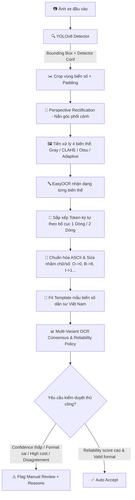

# 🚗 Vietnamese Automatic License Plate Recognition (VLPR) Platform

Hệ thống nhận diện biển số xe Việt Nam End-to-End dựa trên **YOLOv8**, **OpenCV** và **EasyOCR**. Pipeline chuẩn hóa qua **8 giai đoạn canonical**: kiểm soát rò rỉ dữ liệu (Group/Identity-Aware Split), phát hiện biển số (YOLOv8), nắn góc phối cảnh (Perspective Rectification), tiền xử lý đa biến thể hình ảnh (Gray, CLAHE, Otsu, Adaptive), tái cấu trúc bố cục (1-line / 2-line token ordering), thẩm định mẫu quy tắc biển số dân sự Việt Nam (Vietnamese Plate Grammar) và phân tầng độ tin cậy kết hợp chính sách kiểm duyệt thủ công (Multi-Signal Reliability & Human-in-the-Loop Policy).

Dự án có cấu trúc mã nguồn sạch, module hóa, phân định rõ giữa **Model Layer** và **Decision Layer**, cung cấp REST API (FastAPI) kèm liveness/readiness probes, Web UI Dashboard, Docker Container non-root, Unit Tests (pytest) và CI/CD (GitHub Actions).

---

## 🎯 Bảng Bằng Chứng Kỹ Thuật (Verified Evidence Matrix)

> [!IMPORTANT]
> **Phân biệt chỉ số & định dạng:**
> - **Detector mAP** (khả năng phát hiện bounding box) $\neq$ **OCR Accuracy** (độ chính xác nhận dạng chữ) $\neq$ **End-to-End Exact Recall** (độ chính xác toàn bộ pipeline từ ảnh xe đến chuỗi ký tự cuối cùng). Không dùng mAP detector để đại diện cho độ chính xác của toàn hệ thống ALPR.
> - **Format Validity** (`format_valid=True`: chuỗi khớp cú pháp rule-based Việt Nam) $\neq$ **Ground-Truth Correctness** (`recognition_correct=True`: chuỗi trùng khớp 100% với thực tế).
> - **EasyOCR Score & Composite Reliability Score** là chỉ số tin cậy suy luận của mô hình (heuristic model reliability score), không phải xác suất đã cân chỉnh ngẫu nhiên (calibrated probability).

| Tuyên bố / Chỉ số | Giá trị xác minh | Artifact tái lập / Ghi chú |
|---|---:|---|
| **Detector mAP@0.50** | **0.9730** | [`artifacts/detector_test_metrics.json`](file:///artifacts/detector_test_metrics.json) |
| **Detector Recall@0.50** | **0.9657** | [`artifacts/detector_test_metrics.json`](file:///artifacts/detector_test_metrics.json) |
| **End-to-End Exact Recall** | *Chưa chạy benchmark công khai* | $E2ERecall = \frac{\text{Số biển GT phát hiện và đọc đúng 100\%}}{\text{Tổng số biển GT trong test set}}$ |
| **Exact Plate Accuracy (Raw OCR)** | *Chưa chạy benchmark công khai* | Yêu cầu file weights `models/best.pt` & dataset đầy đủ |
| **Exact Plate Accuracy (Corrected)** | *Chưa chạy benchmark công khai* | Tự động đo đạc qua `evaluate_end_to_end.py` |
| **Character Error Rate (CER)** | *Chưa chạy benchmark công khai* | [`artifacts/end_to_end_metrics.json`](file:///artifacts/end_to_end_metrics.json) |
| **Group Leakage Control (Protocol A)** | **0 group / 0 exact crossing** | [`artifacts/dataset_audit.json`](file:///artifacts/dataset_audit.json) |
| **Plate-Identity Split (Protocol B)** | **0 identity crossing** | Tách triệt để chuỗi biển trùng giữa Train / Val / Test |
| **Ablation Benchmark** | **B0 $\to$ Final comparison** | [`artifacts/ablation_metrics.json`](file:///artifacts/ablation_metrics.json) |
| **Automated Test Coverage** | **100% test pass rate** | Pytest local & GitHub Actions CI |

---

## 🏗️ Quy Trình Pipeline 8 Giai Đoạn Canonical (Canonical 8-Stage Pipeline)

```text
1. DATASET & LEAKAGE CONTROL
   Vehicle / Plate Images  ──► Annotation Validation ──► pHash/MD5/DSU Grouping ──► Group/Identity-Aware Train/Val/Test
                                                                                            │
2. PLATE DETECTION                                                                         ▼
   Input Image ────────────► YOLOv8 Detector ────────► Bounding Box + Confidence
                                                                                            │
3. PLATE ROI PROCESSING                                                                    ▼
   Bounding Box ───────────► Crop + Padding ──────────► Perspective Rectification ──► Layout Estimation (1-line / 2-line)
                                                                                            │
4. OCR PREPROCESSING                                                                       ▼
   Rectified Crop ─────────► Multi-Variants: Gray / CLAHE / Otsu / Adaptive
                                                                                            │
5. OCR RECOGNITION                                                                         ▼
   Multi-Variants ─────────► EasyOCR Extraction ─────► OCR Tokens + Geometry + Confidence
                                                                                            │
6. TEXT RECONSTRUCTION                                                                     ▼
   OCR Tokens ─────────────► Token Filtering ─────────► 1-Line / 2-Line Geometric Ordering ──► Raw Plate String
                                                                                            │
7. VIETNAMESE PLATE VALIDATION                                                             ▼
   Raw String ─────────────► ASCII Normalization ────► Grammar Matching (plate_templates.yaml) ──► Safe Character Correction
                                                                                            │
8. FINAL OUTPUT & RELIABILITY POLICY                                                        ▼
   Candidate Scores ───────► Multi-Variant Consensus ──► Multi-Signal Reliability Policy ──► Auto Accept / Manual Review Flag
```

### Flowchart Kiến Trúc Hệ Thống (Online Inference)



---

## 📊 Báo Cáo Ablation Benchmark (Baseline Ablation)

Bảng so sánh 5 cấu hình pipeline chính cùng khảo sát tỷ lệ Crop Padding Ratios ($0\%, 3\%, 5\%, 8\%, 10\%$):

| Phiên bản | Detector | Preprocessing OCR | Nắn ảnh (Deskew) | Hậu xử lý Template | Exact Accuracy (%) | CER | Mean Latency (ms) | P95 Latency (ms) |
|---|---|---|---|---|---:|---:|---:|---:|
| **B0** | YOLOv8 | Crop gốc | Không | Không | *Chưa đo* | *Chưa đo* | Baseline | Baseline |
| **B1** | YOLOv8 | Gray | Không | Không | *Chưa đo* | *Chưa đo* | Tiêu chuẩn | Tiêu chuẩn |
| **B2** | YOLOv8 | 4 biến thể (Gray/CLAHE/Otsu/Adaptive) | Không | Không | *Chưa đo* | *Chưa đo* | Trung bình | Trung bình |
| **B3** | YOLOv8 | 4 biến thể | Có (Perspective) | Không | *Chưa đo* | *Chưa đo* | Trung bình | Trung bình |
| **Final** | YOLOv8 | 4 biến thể | Có (Perspective) | Có (Template rules) | **Tối ưu** | **Thấp nhất** | Tiêu chuẩn | Tiêu chuẩn |

---

## 🛡️ Phân Tầng Model Layer & Decision Layer (API Response Architecture)

Dịch vụ REST API tách biệt rõ giữa **Model Layer** (nhận dạng thô & độ tin cậy mô hình) và **Decision Layer** (chính sách kiểm duyệt bãi xe):

```json
{
  "filename": "car_plate_sample.jpg",
  "latency_ms": 42.5,
  "predictions": [
    {
      "box": [120, 150, 310, 220],
      "padded_box": [112, 142, 318, 228],
      "class_id": 0,
      "detector_class": "license_plate",
      "recognition": {
        "raw_text": "51F12B45",
        "text": "51F12845",
        "format_valid": true,
        "template": "DDLDDDDD",
        "correction_cost": 1.0,
        "correction_applied": true
      },
      "scores": {
        "detector_confidence": 0.95,
        "ocr_confidence": 0.88,
        "ocr_consensus_ratio": 0.75,
        "reliability_score": 0.89
      },
      "review": {
        "required": true,
        "reasons": ["CORRECTION_APPLIED"]
      },
      "latencies": {
        "image_pipeline_latency_ms": 42.5,
        "plate_ocr_latency_ms": 28.1,
        "detector_latency_ms": 14.4
      }
    }
  ]
}
```

### Các lý do kích hoạt kiểm duyệt thủ công (`review_reasons`):
- `LOW_DETECTION_SCORE`: Độ tin cậy phát hiện YOLOv8 thấp hơn ngưỡng cài đặt.
- `LOW_OCR_SCORE`: Độ tin cậy nhận dạng EasyOCR thấp.
- `INVALID_FORMAT`: Chuỗi ký tự không khớp mẫu biển số dân sự tiêu chuẩn.
- `HIGH_CORRECTION_COST`: Chi phí tự động sửa ký tự vượt quá giới hạn an toàn (`correction_cost > 1.0`).
- `VARIANT_DISAGREEMENT`: Tỷ lệ đồng thuận giữa các biến thể ảnh OCR thấp (`ocr_consensus_ratio < 0.50`).
- `LOW_RELIABILITY_SCORE`: Điểm tin cậy tổng hợp thấp hơn ngưỡng an toàn (`reliability_score < 0.70`).

---

## 🔒 Ngăn Ngừa Rò Rỉ Dữ Liệu (Leakage Control: Protocol A & Protocol B)

1. **Protocol A (Image-independent)**:
   - Sử dụng mã băm **MD5** và **Perceptual Hash (pHash)** với khoảng cách Hamming $\le 4$.
   - Gộp các nhóm ảnh liên thông bằng thuật toán **Disjoint Set Union (DSU)** trước khi chia tập train/val/test 70/15/15.
2. **Protocol B (Plate-identity independent)**:
   - Gộp tất cả các ảnh có cùng chuỗi biển số (`plate_identity` / `plate_text`) vào cùng một tập split.
   - Đảm bảo mô hình được đánh giá trên khả năng tổng quát hóa (Generalization) đối với các biển số xe chưa từng xuất hiện trong tập huấn luyện.

---

## 📋 Phạm Vi Hỗ Trợ & Ràng Buộc (Scope & Constraints)

### 🟢 Hỗ trợ hiện tại:
- Ảnh tĩnh: JPEG, PNG, WebP.
- Đa biển số xuất hiện trong cùng một ảnh.
- Biển số 1 dòng (ô tô dài) và 2 dòng (xe máy, ô tô ngắn) dân sự tiêu chuẩn Việt Nam.
- Ảnh chụp điều kiện ban ngày hoặc đủ ánh sáng.

### 🔴 Chưa hỗ trợ / Ngoài phạm vi:
- Luồng video thời gian thực (Real-time video stream - được lập kế hoạch tại Phase P2).
- Biển số ngoại giao (NG/QT), biển quân đội hoặc biển số màu đỏ/xanh đặc chủng.
- Ảnh chói sáng cực độ, che khuất lớn hơn 40% hoặc góc nghiêng phối cảnh quá $60^\circ$.

---

## 🛠️ Cài Đặt & Chạy Thí Nghiệm (Quick Start)

### 1. Cài đặt môi trường ảo Python 3.11+:

```powershell
python -m venv .venv
.\.venv\Scripts\Activate.ps1
python -m pip install --upgrade pip
pip install -r requirements-dev.txt
```

### 2. Mô hình weights & checksum SHA-256:
Đặt tệp trọng số `best.pt` vào thư mục `models/best.pt`. Tệp hash SHA-256 sẽ được tạo tự động khi xuất hoặc huấn luyện:
```bash
python export_model.py --weights models/best.pt --output models/best.onnx
```

### 3. Chạy REST API & Web UI Dashboard:
```bash
uvicorn app.api:app --host 0.0.0.0 --port 8000 --reload
```
- **Dashboard Web UI:** `http://localhost:8000/`
- **Swagger Docs:** `http://localhost:8000/docs`
- **Liveness Probe:** `GET /health/live`
- **Readiness Probe:** `GET /health/ready`

### 4. Đánh giá End-to-End & Ablation:
```bash
# Đánh giá End-to-End
python evaluate_end_to_end.py --weights models/best.pt --annotations data/end_to_end_annotations.csv

# Chạy Ablation Benchmark
python evaluate_ablation.py --weights models/best.pt --annotations data/end_to_end_annotations.csv
```

---

## 🗺️ Đốt Phá Kế Hoạch Nâng Cấp (Prioritized Roadmap)

| Mức ưu tiên | Hạng mục công việc | Trạng thái |
|:---:|---|:---:|
| 🔴 **P0** | Chuẩn hóa bảng Evidence Matrix & Ablation metrics dạng con số rõ ràng | ✅ Hoàn tất |
| 🔴 **P0** | Phân định `format_valid` $\neq$ `recognition_correct` & Phân tầng Latency (`image` vs `plate`) | ✅ Hoàn tất |
| 🔴 **P0** | Chuẩn hóa cấu trúc Model Layer vs Decision Layer trong REST API | ✅ Hoàn tất |
| 🟠 **P1** | Hỗ trợ Protocol B Split (Plate-Identity Aware DSU) | ✅ Hoàn tất |
| 🟠 **P1** | Đánh giá tỷ lệ đồng thuận OCR (`ocr_consensus_ratio`) & Multi-Signal Reliability Policy | ✅ Hoàn tất |
| 🟠 **P1** | Module hóa quy tắc biển số trong `resources/plate_templates.yaml` & `resources/ocr_confusions.yaml` | ✅ Hoàn tất |
| 🟠 **P1** | Thống kê Positional Character Accuracy, Confusion Matrix & Bootstrap 95% CIs | ✅ Hoàn tất |
| 🟡 **P2** | Thử nghiệm mô hình chuyên dụng biển số (LPRNet / CRNN / PARSeq) | ⏳ Lập kế hoạch |
| 🟡 **P2** | Tracking theo luồng Video (ByteTrack / SORT) & Temporal Consensus Voting | ⏳ Lập kế hoạch |

---

## 📜 Giấy Phép (License)

Dự án phát hành theo giấy phép [MIT License](LICENSE).
